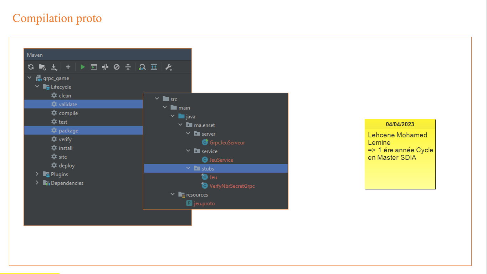
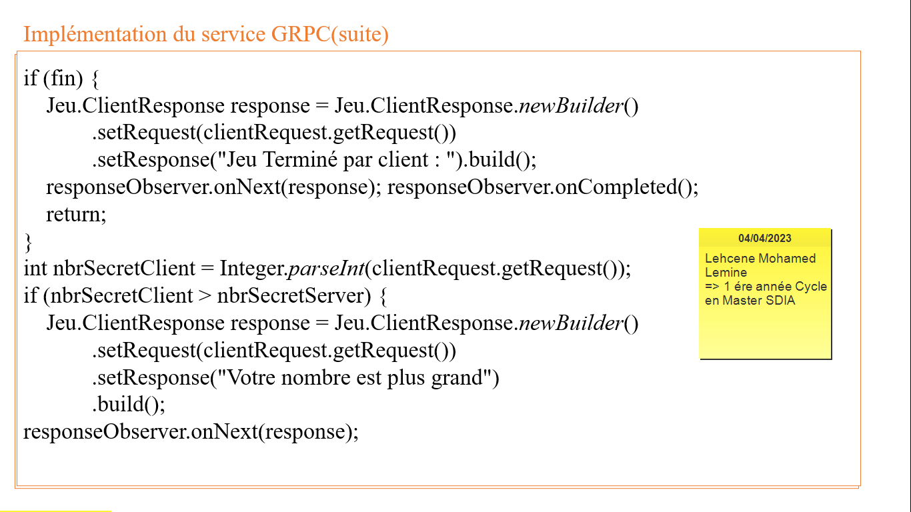

<h2>Compte rendu pour réaliser en tp concerne sur Systèmes Distribués avec GRPC</h2>
<h3> Troisième partie</h3>
<ul>
<h4>-Créer un serveur JEU GRPC :</h4>
<li>Au démarrage le serveur choisit un nombre aléatoire entre 1 et 1000.</li>
<li>Ensuite les clients GRPC doivent deviner en compétition le nombre secret.</li>
<li>le serveur répond à chaque fois avec les éventualités suivantes :
        <ul>
            <li>Votre nombre est plus grand</li>
            <li>Votre nombre est plus petit</li>
            <li>BRAVO vous avez gagné et envoyer le gagnant aux clients</li>
            <li>Jeu terminé, le gagnant est ""Numéro du gagnant"</li>
        </ul>
</li>
</ul>

